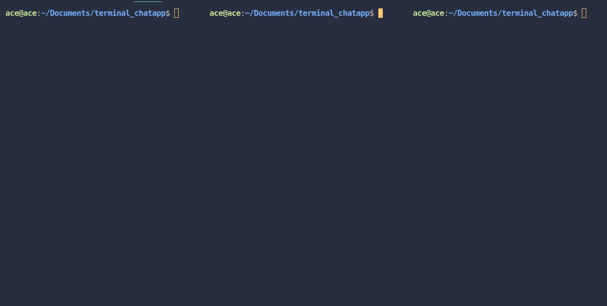
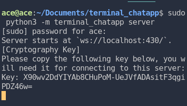
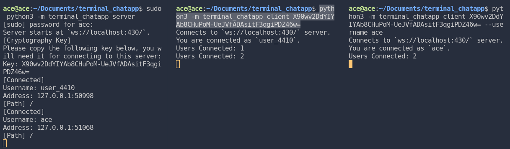
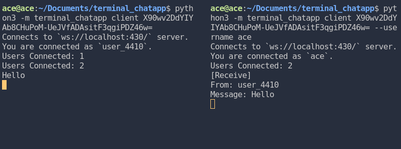
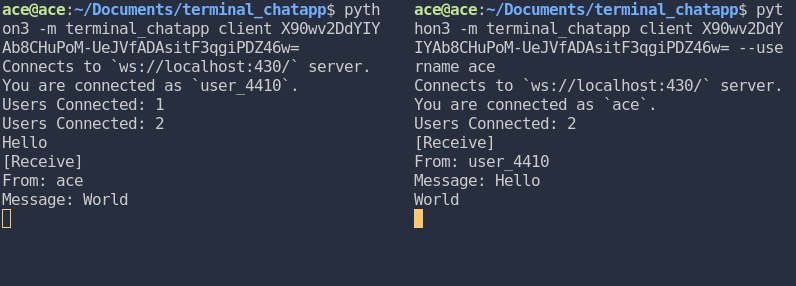
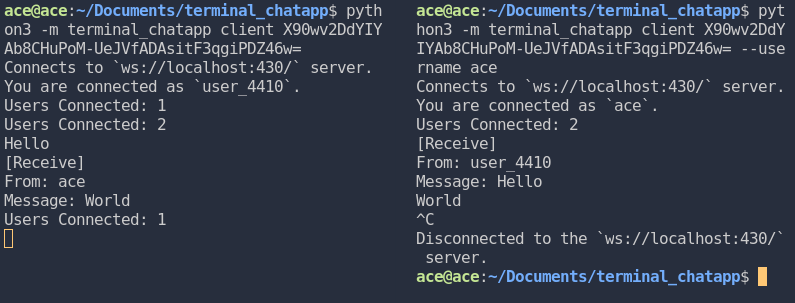

# Terminal Chat Application

Secure communication on terminal.


## Requirements
1. [Python 3+](https://www.python.org/)
2. [Python websockets](https://github.com/aaugustin/websockets)
3. [Python cryptography](https://github.com/pyca/cryptography)


## Installation

By the main repo:
```
$ git clone https://github.com/clediscover/terminal_chatapp/
$ cd terminal_chatapp
$ sudo python3 setup.py install
```

By pip:
```
$ pip install terminal_chatapp
```


## What is Terminal Chat Application? What does it have? and How does it work?

This project has two program, **server** and **client**. The server is used to **open a connection**. The client is the one that will **connect to the server**. All the client that is connected to the server can receive a message from any other client. The server only accepts a connection if its authorized and will reject the request if not. It authorized the request using the authorization header, by checking if its value is the same with the password that is used to run the server. Also it checks the username header, if the username is already registered on the server (meaning other client is using the username and is connected), the server will reject the request.

The client connects with an encrypted authorization and username header. Those headers are encrypted because the server will decrypt it before the client can connect and to be safe from Man In The Middle (MITM) Attack even if the server don't have Secure Socket Layer (SSL). If its not encrypted, the server will know it and will reject the request of the client. 

Authorization header is used as authentication on the server. Username header is used to give an identity to the client. For instance, if the client sends a message to the server. The client username is used to know where the message comes from.

> ### Important
> 
> Running the server program with port of lower than 1024 requires root or administrator previledged.


## Basic Usage

### Run the program as server
Run this on terminal to start running the server.
```
$ sudo python3 -m terminal_chatapp server
```
By default it runs the server on **ws://localhost:1719/**. The server will give you a key on console after you run the server. Make sure that you save the key since you will need that to connect to the server. You can choose your own port by using the `-p` flag. Example: `$ sudo python3 -m terminal_chatapp server -p 123`. This example will open the server on **ws://localhost:123/**. Also it is important to know that by default, the password of the server is `top_secret`. You should change it if you don't want an unathorized person to connect to your server. You can change it by using the `--password` flag. Example: `$ sudo python3 -m terminal_chatapp server --password mysupertoppass`.

### Run the program as client
Run this on terminal to connect to the server.
```
$ python3 -m terminal_chatapp client [key_of_server]
```
The `[key_of_server]` is the key that server prints out when you run the server. It is needed because you will not be able to connect to the server if you don't have that and it is used for cryptography of the conversation between server and client. By default the client program will connect to **ws://localhost:1719/** with an encrypted authorization and username header. The authorization header value is `"top_secret"`, while, username header is `"user_1234"`, the number of username header is randomly selected.

If you want to change the value of the username header, you can use the `--username` flag from server program. Example: `$ python3 -m terminal_chatapp client [key_of_server] --url myusername`

If you want to change where you want to connect, use `--url` flag. Example: `$ python3 -m terminal_chatapp client [key_of_server] --url ws://mychatapp.com:123/`. This will connect to **ws://mychatapp.com:123/**.

For more information on the Command Line Interface (CLI) of server and client program, just run `python3 -m terminal_chatapp -h`, `python3 -m terminal_chatapp server -h`, or `python3 -m terminal_chatapp client -h`. This will show all the available and valid arguments for both client and server program.


## Basic Usage With Picture
1. We have three console opened here that we will use for showing how to use the server and client program.
   
   

2. We run the server as root on the first console. It prints out the key that you will use for connecting the client. Also remember that you can change the password of the server using `--password` flag. But in this case, we will use the default password.
   
   

3. We use the second console to connect to the server with given key from the server. It shows that the client program create its own username which is "user_4410" since we did not specify a username on the command and it shows from the server whose usename is connected and which path did the it go.

    

4. We connect the third console to the server and give it a username as "ace". The server shows again who connects and on both client, it shows how many client is connected to the server.
   
    

5. We send "Hello" message from the first client (user_4410) and it shows the message to second client (ace). Keep in mind that, all message are encrypted before it sends to the websocket server.
   
    

6. We send a "World" message using the second client (ace) and the first client receive it (user_4410).
 
    

7. Last, we disconnect the second client by pressing `CTRL + C` and it can be seen from all the client that is connected to the server.

    